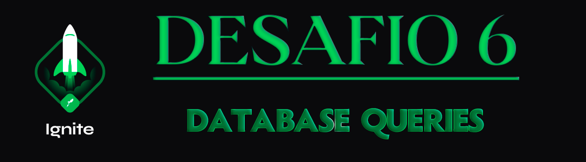

  

<h1 align="center"> RocketSeat 🚀 Ignite NodeJS 🌠</h1>

  
  
  
  

## 🧠 Detalhes do desafio

Nesse desafio, você realizará consultas no banco de dados com o TypeORM de três maneiras:

- [x] Usando o ORM
- [x] Usando Query Builder
- [x] Usando Raw Query

Isso irá te ajudar a entender e exercitar os diferentes tipos de consultas que podemos fazer.

No template, você irá encontrar uma aplicação já estruturada *(apenas as entidades e repositórios)* onde você deverá completar o que falta nas consultas dos dois repositórios.

A aplicação possui dois módulos: `users` e `games`. Um **usuário** pode ter vários jogos e um mesmo **jogo** pode estar associado a vários usuários.

  

Feito com ❤️ por [Augusto Hermes](https://github.com/augustohermes) 👋.
